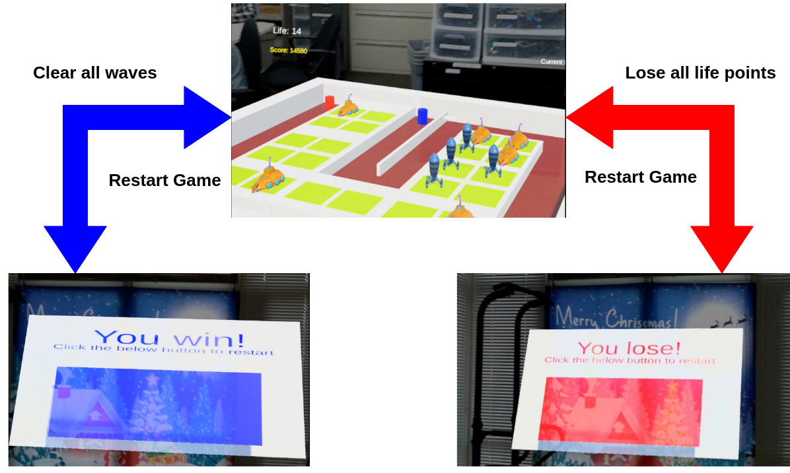

# AR Tower Defense Game on Magic Leap 1

This was the class project of Fall '22 (CS 7470 Mobile & Ubiquitous Computing at Georgia Tech).
The team members were [Jin Heo](https://jheo4.github.io/), Juo-Yang Chen, Seonghun Kang, and James Ramos.
This work was advised by [Thad Starner](https://faculty.cc.gatech.edu/~thad/) and [Rajandeep Singh](https://www.rajandeepsingh.com/).

__*You might use this project for some purposes. At that time, please refer this repository as a credit.*__

## Project Demo Video
Click the below figure to watch the demo video.

## Project Setup and Installation
Refer the [instructions](https://github.com/magicleap/UnityTemplate) from Magic Leap.

## Introduction
The traditional version of the tower defense game is played on desktop and smartphone platforms using a mouse pointer or touchscreen to build towers and attack enemies.
In contrast, the AR version will use a controller to place towers in a virtual 3D space that corresponds to the player's real-world surroundings.
The development process includes not only implementing the game components, but also adapting the game system and interfaces for AR settings.
Additionally, the project aims to extend the single-user game into a multiplayer one, which poses challenges related to synchronizing game states and scenes across users while maintaining coordination in the real world.

## Game Concept
The user's goal is to defend against enemies that are continuously spawned and move towards a destination.
The user must use towers to destroy the enemies before they reach the destination.
The user can install towers on tiles across the map by selecting them from a tower storage and placing them on the map tile.
Once installed, the towers will attack enemies within their attack range.
The user earns game scores for destroying enemies and loses a life point if an enemy reaches the end point.
The objective of the game is to defeat all enemies and the user will lose if all life points are reduced.

## Game System
##### __*Game Scene*__
The map is in the middle and the user moves around it while playing.
The map has a red starting point, a blue end point and a valley with enemies represented as green tablets.
The user installs towers on yellow-colored tower tiles on the map.
On the user's backside, there is a tower storage from which the user can pick and install towers.

##### __*Map Tile*__

The user installs towers spawned at the storage on tiles across the map, with each tile only accommodating one tower.
Initially, the tile is in an installable state and changes to installed when a tower is placed on it.
The user can bring a tower near a tile and it will automatically attach to it like a magnet, with the tile's collider detecting the placed tower and positioning it correctly on its surface, without the need for the user to position the tower correctly.

##### __*Tower*__

The tower starts attacking enemies within its attack range.
There are two types of towers in the game: bullet and laser towers.
Each tower has different attack type, range, speed, and damage.
The laser tower has a long attack range and slow attack speed, while the bullet tower has a short range and fast attack speed.
The main difference between the two towers is their attack type; the laser tower strikes the enemy directly through ray tracing, while the bullet tower fires bullets that fly to the designated enemy position at launch.
So, when the enemy moves fast, it's possible for the enemy to dodge the bullet.

##### __*Tower Storage*__
The tower storage is placed at the back of the user and the user can interact with it to pick up ready-to-go towers as soon as possible.
The storage randomly produces a tower (either laser or bullet) every 10 seconds and has an internal timer for creating a tower and its state: occupied and vacant.
Initially, the storage is vacant and its spawning timer starts.
When the tower is created in the storage after the timer goes over 10 seconds, its state is changed to occupied.
When the user picks up the created tower from the storage, the state becomes vacant and the spawning timer starts again.

##### __*Enemy with Game AI*__
Enemies are spawned from the starting point (red cylinder) using the starting point object, which instantiates an enemy instance from a prefab.
The game map is pre-computed with path information using the Unity navigation mesh (NavMesh) functionality.
The enemy, as a NavMesh agent, navigates the map and moves to the end point.
The navigation process runs as a coroutine function that directs the enemy instance through the map paths.
When an enemy arrives at the end point, it triggers the end point's collider, which detects the collision and destroys the instantiated enemy, reducing the life point.

##### __*Wave System*__
For each wave, the number of spawned enemies, HP, movement speed, and score are set differently.
As the wave stage increases, the enemies will become faster and stronger, but the user will earn more points by destroying them.
The wave system is critical for making the game enjoyable for users.
If it is too easy or hard, players will lose interest quickly.
The number of installed towers increases and the wave system should adjust the difficulty level accordingly.
The wave system is managed by the wave manager, which sets attributes related to wave difficulty and reward.

-------

### User interface

##### __*User Interaction*__
The game uses the device's inputs, one of which is the user's location and head pose in the virtual space, which is mapped to the camera in the scene.
This allows the user to be localized in the virtual space and their movement in the real world to be reflected in the virtual scene.
Another input is from the controller, which is also virtualized and exists in the game scene.
The controller has a raycast-based interface that allows the user to pick, move, and install towers in the virtual space by casting a ray from the controller's head.

##### __*Game Status Interface*__
The interface shows the user's current life point and score on the left top, and the current wave stage information and number of existing enemies on the right top.
The life point interface updates when an enemy is removed by the end point, the scoring interface updates only when an enemy is destroyed by the tower attack event, the current wave updates as the wave manager starts each wave and the existing enemy information updates by the spawning event of the starting point and the destroy events of the towers and end point.

##### __*Win/Loss Menu*__

There are two possible outcomes of the gameplay; the user can win by defending all waves or lose by losing all life points.
For each outcome, the game directs the user to proper menu options by adding two game scenes - win and loss scenes.
In the current implementation, the user can select the button to restart the game for both win/loss scenes, but for further implementation, it would be beneficial to have more menus including exit and scoreboard menus.
